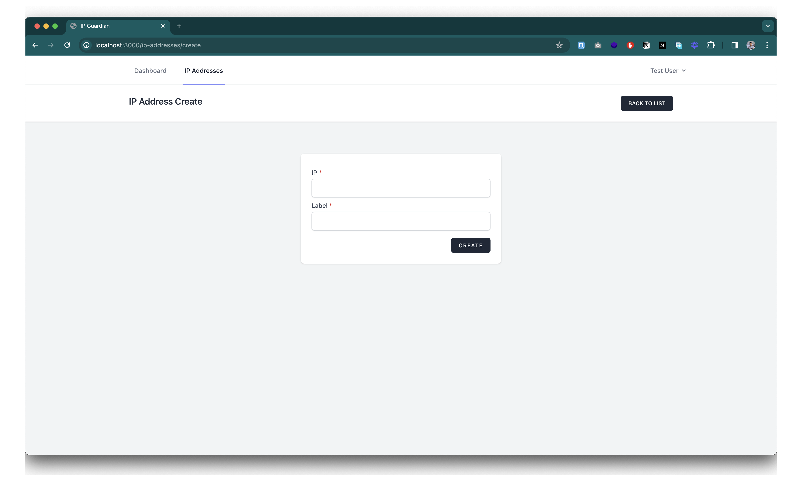

# IPGuardian

IPGuardian is simple Laravel and React based application that allows you to list your IP addressesand their audit logs.

## Installation

### Pre-requisites
- Docker
- Docker Compose

### Steps
1. Clone the repository
```
git@github.com:nayeemdev/IPGuardian.git
```
2. Run the docker compose command to build and run the containers
```
docker-compose up -d
```
3. Run the api sh to get into the api container
```
docker-compose exec -it api sh
```
4. Run the following commands inside the api container
```
cp .env.example .env
composer install
php artisan key:generate
php artisan migrate --seed
```

5. Run the client sh to get into the client container
```
docker-compose exec -it client sh
```
6. Run the following commands inside the client container
```
cp .env.example .env
npm install
```
7. Run tests inside the api container
```
docker exec -it api sh
php artisan test
```
8. Demo user credentials
```
email: test@example.com
password: password
```
***
Note:*Api will open at `localhost:8000`, Client app will run at `localhost:3000`*
***
*I have added a makefile to make the process easier. You can  run `make help` to see all the available commands.*
***

## Built With
- PHP8.2
- Laravel 10
- Laravel Sanctum
- NginX
- MySQL
- React
- TailwindCSS
- SWR
- React Router
- Axios
- Docker
- Docker Compose


## How to
1. Make sure you have the api and client container running
2. Open `localhost:3000` in your browser to see the client app
3. Login with the demo user credentials
4. Or register a new user and login
5. You can see the dashboard with a count card.
6. Create a new IP address from the CREATE NEW RECORD button
7. You can see the list of IP addresses in the dashboard
8. You can see the audit logs of an IP address by clicking the VIEW button
9. You can edit an IP address by clicking the EDIT button

## API Documentation
- [Postman Collection](https://api.postman.com/collections/9744215-32eab5db-53aa-439f-bec2-96f347df0574?access_key=PMAT-01HJ68TTT243RPMYMNHCQKQY68)
- [API Documentation](https://documenter.getpostman.com/view/9744215/2s9Ykq8gP8)

## Screenshots





